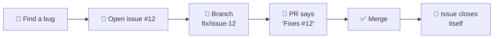
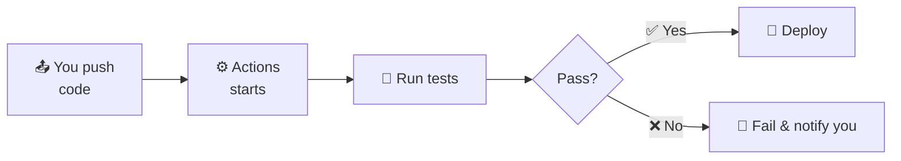

<a id="top"></a>

<div align="center">

# 🐙 GitHub Features: The Complete Guide

### Git is the tool. GitHub is everything built around it.

*What each feature is, why it exists, how to use it, and when to use it.*

<br>


<br>

[⬅️ Back to the Git basics (README)](README.md)

</div>

<br>

---

## 📚 Contents

| | | |
|---|---|---|
| 🔑 [1. Logging in (HTTPS vs SSH)](#login) | 🗂️ [2. Creating a good repo](#create) | 📄 [3. Special files](#special-files) |
| 🐛 [4. Issues](#issues) | 🔀 [5. Pull Requests](#prs) | 👥 [6. Collaborators & orgs](#collab) |
| 🛡️ [7. Branch protection](#protection) | 📊 [8. Projects](#projects) | ⚙️ [9. Actions (CI/CD)](#actions) |
| 🌐 [10. Pages (deploying)](#pages) | 📖 [11. Wiki](#wiki) | 💬 [12. Discussions](#discussions) |
| 🏷️ [13. Releases](#releases) | ☁️ [14. Codespaces](#codespaces) | 🔒 [15. Security](#security) |
| 📝 [16. Gists](#gists) | ⭐ [17. Social features](#social) | 🪪 [18. Profile README](#profile) |
| 💻 [19. GitHub CLI](#cli) | 🧭 [20. Which feature?](#which) | 🚧 [21. Common mistakes](#mistakes) |

---

<a id="login"></a>
## 🔑 1. Logging In From Your Computer (HTTPS vs SSH)

> [!IMPORTANT]
> GitHub **no longer accepts your account password** for `git push` / `git pull`. You must prove who you are another way. This is the first thing that trips up beginners.

<table>
<tr>
<td width="50%" valign="top">

### 🅰️ HTTPS + Token
*Easiest to start with*

1. GitHub → profile picture → **Settings**
2. **Developer settings** → **Personal access tokens**
3. Generate a token with `repo` access
4. When Git asks for a password, **paste the token**

💡 Install [Git Credential Manager](https://github.com/git-ecosystem/git-credential-manager) (included with Git for Windows) so you only log in once.

</td>
<td width="50%" valign="top">

### 🅱️ SSH Keys
*Set up once, never type credentials again*

```bash
ssh-keygen -t ed25519 -C "you@example.com"
cat ~/.ssh/id_ed25519.pub
```

Copy the output, then: **Settings → SSH and GPG keys → New SSH key** → paste.

Test it:
```bash
ssh -T git@github.com
```

</td>
</tr>
</table>

Use the SSH URL when linking a repo:

```bash
git remote add origin git@github.com:username/repo-name.git
```

> [!CAUTION]
> **Never** share your token or your private key (`id_ed25519`, the one without `.pub`). Never commit them to a repo.

---

<a id="create"></a>
## 🗂️ 2. Creating a Good Repository

On GitHub: **+** (top right) → **New repository**.

| ⚙️ Option | 💬 What it means |
|---|---|
| **Visibility** | **Public** = anyone can see. **Private** = only you and people you invite |
| **Add a README** | Creates the front page of your repo. Skip it if you're pushing an existing local project |
| **Add .gitignore** | Pick a template for your language (Python, Node, C++, etc.) |
| **Choose a license** | Tells others what they're allowed to do with your code |

### 📜 Which license?

| License | In plain words |
|---|---|
| **MIT** | Very permissive. Anyone can use your code, just keep your name. Most common for personal projects |
| **Apache 2.0** | Like MIT, plus patent protection |
| **GPL v3** | Anyone who uses your code must also open-source theirs |
| **No license** | Legally, nobody else may reuse your code, even if it's public |

> [!TIP]
> Not sure? **MIT** is the usual safe choice for learning projects. (This isn't legal advice, so check the terms for serious or commercial work.)

<details>
<summary><b>🔧 Repo settings worth knowing</b></summary>

<br>

The **Settings** tab holds: renaming the repo, changing visibility, default branch, enabling Wiki / Issues / Discussions, Pages, collaborators, branch protection, secrets, and the **danger zone** (delete or transfer the repo).

🏷️ **Topics:** add keywords (like `git`, `tutorial`, `beginners`) on the repo's main page so people can find it in search.

</details>

---

<a id="special-files"></a>
## 📄 3. Special Files Every Repo Should Know

GitHub treats certain file names specially:

| 📁 File | ✨ What GitHub does with it |
|---|---|
| `README.md` | Shown as the front page of your repo |
| `LICENSE` | Shows the license badge and details on the repo page |
| `.gitignore` | Tells Git what NOT to track |
| `CONTRIBUTING.md` | Linked when someone opens an issue or PR. Explains how to contribute |
| `CODE_OF_CONDUCT.md` | Sets behavior rules for the community |
| `SECURITY.md` | Explains how to report security problems privately |
| `CODEOWNERS` | Auto-requests review from specific people for specific files |
| `.github/ISSUE_TEMPLATE/` | Pre-made forms for new issues |
| `.github/pull_request_template.md` | Pre-filled text for new PRs |
| `.github/workflows/*.yml` | GitHub Actions automation files |

<details>
<summary><b>📝 Example PR template</b> (<code>.github/pull_request_template.md</code>)</summary>

<br>

```markdown
## What does this PR do?

## How was it tested?

## Checklist
- [ ] I read CONTRIBUTING.md
- [ ] My code runs without errors
```

</details>

---

<a id="issues"></a>
## 🐛 4. Issues

**What:** A built-in tracker for bugs, tasks, questions, and feature ideas.
**Why:** Keeps discussion about work attached to the code, instead of scattered in chats.

**Create one:** repo → **Issues** tab → **New issue** → title + description.

| 📎 You can attach | |
|---|---|
| 🏷️ **Labels** | `bug`, `enhancement`, `documentation`, `good first issue` |
| 👤 **Assignees** | Who is responsible |
| 🎯 **Milestones** | Group issues into a goal, like "v1.0 release" |
| 📊 **Projects** | Show it on a board |

### 🔗 Linking issues and code

Write one of these words in a PR description or commit message, and GitHub **closes the issue automatically** when the PR merges into the default branch:

```text
Fixes #12
Closes #12
Resolves #12
```

> [!NOTE]
> `@username` notifies a person. `#12` links to issue or PR number 12.

**Real-life flow:**



---

<a id="prs"></a>
## 🔀 5. Pull Requests (In Depth)

> The basics are in the [README](README.md#pull-requests). Here is the deeper picture.

**📝 Draft PR:** open a PR marked "Draft" when work isn't ready. It tells teammates "not ready for review yet". Click **Ready for review** when done.

**👀 What a reviewer can choose:**

| Choice | Meaning |
|---|---|
| 💬 **Comment** | General feedback |
| ✅ **Approve** | Looks good |
| ❌ **Request changes** | Must fix before merging |

### 🧩 Three ways to merge a PR

| Method | Result | Use when |
|---|---|---|
| **Merge commit** | Keeps every commit and adds a merge commit | You want full history |
| **Squash and merge** | Combines all PR commits into ONE commit | Messy commits like "fix", "fix again", "oops" |
| **Rebase and merge** | Replays commits in a straight line | You want linear history without a merge commit |

<details>
<summary><b>🍴 Keeping your fork up to date</b></summary>

<br>

```bash
git remote add upstream https://github.com/original-owner/repo.git
git fetch upstream
git checkout main
git merge upstream/main
git push origin main
```

Or just click the **Sync fork** button on GitHub.

</details>

**✨ Good PR habits**

- 🎯 Keep PRs small and focused on one thing
- ✍️ Write what changed and **why**
- 🔗 Link the issue (`Fixes #12`)
- 🤝 Respond to review comments politely and push fixes to the same branch. The PR updates automatically

---

<a id="collab"></a>
## 👥 6. Collaborators, Roles & Organizations

**Add a collaborator:** repo → **Settings** → **Collaborators** → **Add people** (they get an invitation).

| 🎖️ Role | ✅ Can do |
|---|---|
| 👁️ **Read** | View and clone |
| 🧹 **Triage** | Manage issues and PRs (no code push) |
| ✏️ **Write** | Push code, merge PRs |
| 🔧 **Maintain** | Manage the repo without dangerous settings |
| 👑 **Admin** | Everything, including deleting the repo |

**🏢 Organizations:** a shared account for teams or companies (e.g., a class project group). Repos belong to the organization, not one person, and you can create **Teams** inside with different permissions.

> [!TIP]
> Personal repo for your own projects. Organization when several people share ownership.

---

<a id="protection"></a>
## 🛡️ 7. Branch Protection & Rulesets

**What:** Rules that protect important branches (usually `main`).
**Why:** Stops accidents, like pushing broken code straight to `main` or deleting it.

**Set it up:** repo → **Settings** → **Branches** (or **Rules → Rulesets**) → add a rule for `main`.

**Common rules:**

- ✅ Require a **pull request** before merging (no direct pushes)
- ✅ Require **approvals** from reviewers
- ✅ Require **status checks** to pass (like your Actions tests)
- 🚫 Block **force pushes** and branch deletion

> [!NOTE]
> Protection rules for private repos may depend on your GitHub plan.

---

<a id="projects"></a>
## 📊 8. GitHub Projects

**What:** Planning boards (Kanban-style columns like **Todo → In Progress → Done**) and tables, built right into GitHub.
**Why:** Track who is doing what, tied to real issues and PRs.

**Use it:** your profile or organization → **Projects** → **New project** → choose Board or Table → add issues/PRs as cards.

```text
┌─────────────┬──────────────┬─────────────┐
│  📝 Todo    │ 🚧 In Progress│  ✅ Done    │
├─────────────┼──────────────┼─────────────┤
│ #14 Footer  │ #12 Login    │ #9 Homepage │
│ #15 Search  │              │ #10 Navbar  │
└─────────────┴──────────────┴─────────────┘
```

**Real-life use:** a group semester project. Each task is an issue, and the board shows everyone's progress.

---

<a id="actions"></a>
## ⚙️ 9. GitHub Actions (Automation / CI-CD)

**What:** Automation that runs on GitHub's servers when something happens in your repo (a push, a PR, a schedule).
**Why:** Test, build, check, and deploy code automatically instead of by hand.

| 🔤 Term | 💬 In plain words |
|---|---|
| **CI** (Continuous Integration) | Every push is automatically built and tested |
| **CD** (Continuous Delivery/Deployment) | If tests pass, the code is automatically released or deployed |



**How it works:** you add a **workflow** file at `.github/workflows/name.yml`.

<details open>
<summary><b>📝 Example: run tests on every push and PR (Python)</b></summary>

<br>

```yaml
name: Tests

on:
  push:
    branches: [main]
  pull_request:

jobs:
  test:
    runs-on: ubuntu-latest
    steps:
      - uses: actions/checkout@v4
      - uses: actions/setup-python@v5
        with:
          python-version: "3.12"
      - run: pip install -r requirements.txt
      - run: pytest
```

</details>

| 🧱 Part | 💬 Meaning |
|---|---|
| `on` | The **trigger** (push, pull_request, schedule, manual) |
| `jobs` | Groups of work |
| `runs-on` | The machine type (Linux, Windows, macOS) |
| `steps` | Individual tasks, run in order |
| `uses` | Reuse a ready-made action from the community |
| `run` | Run a shell command |

**👀 See results:** repo → **Actions** tab. A green ✅ or red ❌ also shows on commits and PRs.

**🔐 Secrets (passwords / API keys):** repo → **Settings** → **Secrets and variables** → **Actions**. Use them in a workflow as `${{ secrets.MY_KEY }}`.

> [!WARNING]
> Never write secrets directly in a workflow file or any other file in the repo.

**Other things Actions can do:** run on a schedule (`cron`), lint code, build Docker images, publish packages, deploy to a website or server, label issues automatically.

> [!NOTE]
> Free usage has limits (more generous for public repos). Check GitHub's current pricing page if you run lots of jobs.

---

<a id="pages"></a>
## 🌐 10. GitHub Pages (Free Website Hosting / Deploying)

**What:** Free hosting for **static websites** (HTML, CSS, JavaScript, images) directly from a repo.
**Why:** Publish a portfolio, project demo, documentation, or blog without paying for a server.

> [!WARNING]
> Pages only serves files. It **cannot** run server code (Python Flask, Node backends, databases). For those you need another host.

### 🚀 Deploy the simplest way (from a branch)

| Step | Action |
|:-:|---|
| **1** | Put your site in the repo with an `index.html` at the root |
| **2** | Push it to GitHub |
| **3** | Repo → **Settings** → **Pages** |
| **4** | Under **Build and deployment** → Source: **Deploy from a branch** |
| **5** | Choose branch `main` and folder `/ (root)` → **Save** |
| **6** | Wait a minute or two. Your URL appears at the top of that page |

**🔗 Your site URL:**

| Type | URL |
|---|---|
| 📦 Project site | `https://username.github.io/repo-name/` |
| 🙋 User site | Name the repo exactly `username.github.io` → `https://username.github.io/` |

<details>
<summary><b>🛠️ Deploy with GitHub Actions</b> (React, Vue, Jekyll, etc.)</summary>

<br>

If your site needs a **build step** (for example `npm run build`), set Source to **GitHub Actions**, and use a workflow that builds the site and uploads the output folder (`dist/` or `build/`). GitHub provides starter workflows in the **Actions** tab.

</details>

<details>
<summary><b>🌍 Custom domain</b></summary>

<br>

In **Settings → Pages → Custom domain**, enter your domain, then add the DNS records your domain provider requires. Turn on **Enforce HTTPS**.

</details>

### 🩺 Common problems

| 😵 Problem | 🔍 Likely cause |
|---|---|
| 404 error | No `index.html` in the root/selected folder, or the deploy hasn't finished |
| CSS/images missing | Wrong file paths (project sites live under `/repo-name/`) |
| Changes not showing | Deploy still running (check the **Actions** tab) or browser cache. Try a hard refresh |

> [!NOTE]
> Pages for private repos may depend on your GitHub plan.

---

<a id="wiki"></a>
## 📖 11. GitHub Wiki

**What:** A separate, built-in documentation area for your repo. Every repo can have a wiki, made of pages written in Markdown.
**Why:** For longer documentation that would make your README too big: tutorials, guides, design notes, FAQs.

**Enable it:** repo → **Settings** → **Features** → tick **Wikis**. A **Wiki** tab appears.

**Use it:**

- 📄 **Create the first page**, then **New Page** for more
- 🔗 Use `[[Page Name]]` to link between wiki pages
- 🧭 Add a `_Sidebar` page for navigation and a `_Footer` page for a footer
- 🕘 Pages are edited in the browser, with full history

> [!TIP]
> **The wiki is its own Git repo!** You can work on it offline:
> ```bash
> git clone https://github.com/username/repo-name.wiki.git
> ```
> Edit the `.md` files, then `git add`, `git commit`, `git push` like normal.

### 🥊 Wiki vs README vs `docs/` folder

| | 🎯 Best for |
|---|---|
| **README** | Quick overview, install steps, basic usage |
| **Wiki** | Long guides that many people may edit |
| **`docs/` folder** | Docs that should be versioned with the code and reviewed through PRs (a wiki can't use PR review) |

---

<a id="discussions"></a>
## 💬 12. GitHub Discussions

**What:** A forum inside your repo for conversations that are NOT bugs or tasks.
**Why:** Keeps Issues clean. Questions, ideas, and announcements go here instead.

**Enable it:** **Settings → Features → Discussions**.

**Categories:** 📢 Announcements, 💭 General, 💡 Ideas, ❓ Q&A (an answer can be marked ✅), 🙌 Show and tell.

| | 🐛 **Issue** | 💬 **Discussion** |
|---|---|---|
| **Use for** | Something to fix or build | Open conversation |
| **Example** | "The login button crashes" | "How should I structure my project?" |

---

<a id="releases"></a>
## 🏷️ 13. Releases & Tags

**What:** A **release** is a polished, downloadable version of your project, built from a Git tag.
**Why:** Gives users a stable version (`v1.0.0`) with notes, instead of making them grab the latest messy code.

```bash
git tag v1.0.0
git push origin v1.0.0
```

Then on GitHub: repo → **Releases** → **Draft a new release** → choose the tag → write notes (or click **Generate release notes**) → attach files (installers, zips) → **Publish**.

### 🔢 Versioning (Semantic Versioning): `MAJOR.MINOR.PATCH`

| Change | Example | Meaning |
|---|---|---|
| 🩹 **Patch** | `1.0.0 → 1.0.1` | Bug fix |
| ✨ **Minor** | `1.0.0 → 1.1.0` | New feature, nothing breaks |
| 💥 **Major** | `1.0.0 → 2.0.0` | Breaking change |

---

<a id="codespaces"></a>
## ☁️ 14. Codespaces & the Web Editor

| 🧰 Tool | 💬 What it is | ▶️ How |
|---|---|---|
| ☁️ **Codespaces** | A full VS Code environment in your browser, with your repo already loaded | Repo → green **Code** button → **Codespaces** → **Create codespace** |
| ⚡ **Web editor** | A lightweight VS Code in the browser, great for small edits | Press the **`.`** (period) key on any repo page |
| ✏️ **Quick edit** | Fix a typo without leaving GitHub | Open a file → pencil icon → edit → **Commit changes** |

> [!NOTE]
> Codespaces has free monthly usage for personal accounts, then limits apply. **Stop your codespace when you're done.**

Great for trying a project without installing anything, or coding from a tablet or borrowed laptop.

---

<a id="security"></a>
## 🔒 15. Security Features

| 🛡️ Feature | 💬 What it does |
|---|---|
| **Dependabot alerts** | Warns you when a library you use has a known vulnerability |
| **Dependabot updates** | Opens PRs automatically to update outdated libraries |
| **Secret scanning** | Detects passwords/API keys accidentally committed |
| **Code scanning (CodeQL)** | Analyzes code for security bugs |
| **Security advisories** | Report and publish vulnerabilities responsibly |
| **2FA** (two-factor authentication) | Protects your account. Turn it on! |

Find these under repo → **Settings → Code security** and the **Security** tab. Availability of some features depends on whether the repo is public/private and your plan.

> [!CAUTION]
> ### 🚨 If you accidentally push a secret (password, API key, token)
> 1. **Revoke/rotate it immediately** at the service that issued it. This is the most important step
> 2. Remove it from the code and use environment variables or Actions secrets
> 3. Deleting it in a new commit does **not** remove it from history. Treat the secret as leaked

> [!TIP]
> **Prevent it:** put `.env` in `.gitignore` *before* your first commit.

---

<a id="gists"></a>
## 📝 16. Gists

**What:** Tiny repos for sharing a single file or snippet. Find them at [gist.github.com](https://gist.github.com).
**Why:** Quick sharing of a code snippet, config, or note without making a whole repository.

| Type | Visibility |
|---|---|
| 🌍 **Public gist** | Discoverable by anyone |
| 🔗 **Secret gist** | Not listed, but anyone with the link can see it (not truly private) |

Gists are Git repos too, so they have history and can be cloned.

---

<a id="social"></a>
## ⭐ 17. Social Features: Stars, Watch, Follow

| | Feature | Meaning |
|:-:|---|---|
| ⭐ | **Star** | Bookmark a repo and show appreciation |
| 👀 | **Watch** | Get notifications about a repo's activity |
| 🍴 | **Fork** | Copy a repo to your account |
| 👤 | **Follow** | See another user's activity in your feed |
| 🔎 | **Explore / Search** | Find projects, topics, and trending repos |

> [!TIP]
> Useful search filters: `language:python stars:>1000` or `label:"good first issue"` to find beginner-friendly open-source tasks.

---

<a id="profile"></a>
## 🪪 18. Your Profile README (Portfolio)

A special repo can turn your GitHub profile into a mini homepage.

| Step | Action |
|:-:|---|
| **1** | Create a **public** repo named **exactly your username** (e.g., `qandeel/qandeel`) |
| **2** | Add a `README.md` to it |
| **3** | Its contents now show at the top of your profile |

**Put in it:** who you are, what you're learning, your projects, how to reach you.

📌 Also **pin up to 6 repositories** on your profile to showcase your best work. Good READMEs on those repos matter, since recruiters look at them.

---

<a id="cli"></a>
## 💻 19. GitHub CLI (`gh`)

**What:** A command-line tool for GitHub features (PRs, issues, repos) without opening the browser. Install from [cli.github.com](https://cli.github.com).

```bash
gh auth login                          # log in (also handles credentials for Git)
gh repo create my-project --public     # create a repo on GitHub
gh repo clone username/repo-name       # clone a repo
gh issue create                        # open an issue
gh issue list                          # list issues
gh pr create                           # open a pull request from your current branch
gh pr list                             # list PRs
gh pr checkout 42                      # download PR #42 to test it
gh pr merge                            # merge a PR
```

> [!NOTE]
> It's optional, but it speeds up daily work once you're comfortable with the basics.

---

<a id="which"></a>
## 🧭 20. Which Feature Should I Use?

| 🎯 I want to... | ✅ Use |
|---|---|
| Report a bug or track a task | 🐛 **Issues** |
| Ask a question or share an idea | 💬 **Discussions** |
| Propose code changes | 🔀 **Pull Request** |
| Run tests / deploy automatically | ⚙️ **Actions** |
| Host a static website for free | 🌐 **Pages** |
| Write long documentation | 📖 **Wiki** or a `docs/` folder |
| Share a version people can download | 🏷️ **Releases** |
| Plan work on a board | 📊 **Projects** |
| Share a tiny snippet | 📝 **Gist** |
| Code without installing anything | ☁️ **Codespaces** |
| Stop people breaking `main` | 🛡️ **Branch protection** |
| Get warned about vulnerable libraries | 🔒 **Dependabot** |

---

<a id="mistakes"></a>
## 🚧 21. Common Mistakes

| 😬 Mistake | 🛟 Fix |
|---|---|
| Password rejected on `git push` | Use a Personal Access Token or SSH key ([section 1](#login)) |
| Pushed `.env` or a key | **Revoke it first.** Then add it to `.gitignore` |
| Created repo WITH a README, then `git push` fails (histories differ) | Create it empty, or run `git pull origin main --allow-unrelated-histories` first |
| Pages shows 404 | Make sure `index.html` is in the selected folder and the deploy finished |
| Huge messy PR | Split into small PRs, one idea each |
| Working directly on `main` | Make a branch, open a PR |
| No README or license | Add both. They make a repo usable and trustworthy |
| Committing `node_modules/` or build files | Add them to `.gitignore` |

---

<div align="center">

### 🎓 You now know the whole GitHub toolbox.

Start small: **Issues + Pull Requests + Pages**, then add the rest when you need it.

<br>

[⬆️ Back to top](#top) &nbsp;•&nbsp; [⬅️ Back to Git basics](README.md)

</div>
