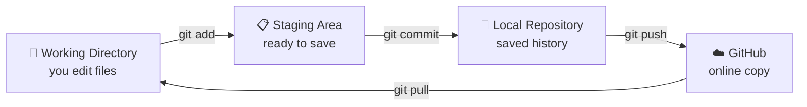
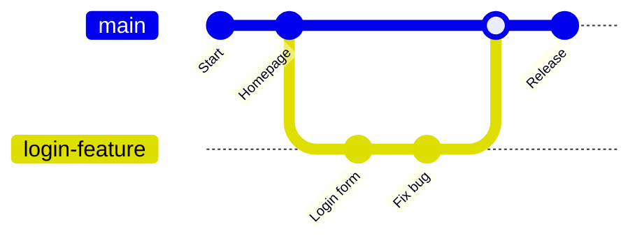
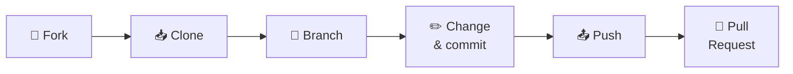

<div align="center">

<a id="top"></a>

# 🌱 Git & GitHub for Beginners

### Learn version control from zero to confident

*Simple words. Real commands. No confusing jargon.*

<br>


<br>

[🚀 Quick Start](#quick-start) &nbsp;•&nbsp;
[📚 Contents](#contents) &nbsp;•&nbsp;
[🐙 GitHub Features](GITHUB_FEATURES.md) &nbsp;•&nbsp;
[📋 Cheat Sheet](#cheat-sheet)

</div>

<br>

---

<a id="quick-start"></a>
## 🚀 Quick Start

> [!TIP]
> In a hurry? Learn these **5 commands** first. They cover about 90% of daily use.

```bash
git add .                  # 1. stage your changes
git commit -m "message"    # 2. save a snapshot
git push                   # 3. upload to GitHub
git pull                   # 4. download the latest
git status                 # 5. check what's going on
```

### 🗺️ How this repo is organized

| 📄 File | 🎯 What's inside | 👤 Read it when |
|---|---|---|
| **README.md** (this file) | Git basics, branching, fixing mistakes | You are just starting |
| **[GITHUB_FEATURES.md](GITHUB_FEATURES.md)** | Pages, Wiki, Actions, Issues, Projects, security, SSH login | You know the basics and want to use GitHub fully |

---

<a id="contents"></a>
## 📚 Contents

| # | Topic | | # | Topic |
|:-:|---|---|:-:|---|
| 1 | [What is Git & GitHub?](#what-is) | | 8 | [Pull Requests](#pull-requests) |
| 2 | [Why learn this?](#why) | | 9 | [Merge Conflicts](#conflicts) |
| 3 | [Install & Set Up](#install) | | 10 | [Fixing Mistakes](#mistakes) |
| 4 | [Key Concepts](#concepts) | | 11 | [.gitignore](#gitignore) |
| 5 | [Core Daily Commands](#daily) | | 12 | [Handy Extras](#extras) |
| 6 | [Upload Your First Project](#upload) | | 13 | [GitHub Features](#features) |
| 7 | [Branching & Merging](#branching) | | 14 | [Workflows & Cheat Sheet](#cheat-sheet) |

---

<a id="what-is"></a>
## 🧩 1. What Even Is Git & GitHub?

|  | 🛠️ **Git** | ☁️ **GitHub** |
|---|---|---|
| **What it is** | A tool that tracks changes to your files | A website that stores your Git projects online |
| **Runs where** | On your computer | In the cloud |
| **Needs internet?** | ❌ No | ✅ Yes |
| **In one line** | Your project's "save history" | Your project's online home |

> [!NOTE]
> Think of Git like the **undo history of a video game save file**, and GitHub like **cloud storage** for that save file, where friends can also help you play.

- ✅ You can use Git **without** GitHub (fully local).
- ❌ You **cannot** use GitHub without Git.
- 🔁 **GitLab** and **Bitbucket** are alternatives to GitHub. Same Git underneath, different website.
- 👨‍💻 Git was created by Linus Torvalds (the creator of Linux) in 2005.

---

<a id="why"></a>
## 🎯 2. Why Bother Learning This?

| | Reason |
|:-:|---|
| 🧑‍💻 | **Every tech job expects it.** It's the #1 tool for coding collaboration |
| 💾 | **Never lose work.** Every version is saved and recoverable |
| 🧪 | **Experiment safely.** Try ideas on a branch without breaking your main project |
| 🌍 | **Build a portfolio.** Your GitHub profile is basically your coding resume |
| 🤝 | **Work with others.** Teams combine code without chaos |
| 📝 | **Not just code.** Great for notes, configs, and documentation too |

---

<a id="install"></a>
## ⚙️ 3. Install & Set Up Git

| 🖥️ System | 📥 How to install |
|---|---|
| 🪟 **Windows** | Download from [git-scm.com](https://git-scm.com) |
| 🍎 **Mac** | `brew install git` (may already be installed) |
| 🐧 **Linux** | `sudo apt install git` (Debian/Ubuntu) or `sudo dnf install git` (Fedora) |

**Tell Git who you are** (do this once, required before your first commit):

```bash
git config --global user.name "Your Name"
git config --global user.email "you@example.com"
```

**Check it worked:**

```bash
git --version
git config --list
```

> [!IMPORTANT]
> Planning to push to GitHub? GitHub no longer accepts your account password for pushing. You'll need a token or an SSH key. See [GITHUB_FEATURES.md → Logging in](GITHUB_FEATURES.md#login).

---

<a id="concepts"></a>
## 🧠 4. Understand the Key Concepts

Every file moves through **three zones** on its way to GitHub:



| 📖 Term | 💬 Meaning |
|---|---|
| **Repository (repo)** | A project folder tracked by Git |
| **Commit** | A saved snapshot with a message |
| **Branch** | A separate line of work, like a parallel universe of your project |
| **HEAD** | A pointer to the branch/commit you're currently on |
| **Staging area** | A waiting room for changes before you commit them |
| **Remote** | A copy of your repo hosted elsewhere (e.g., GitHub) |
| **Clone** | A local copy of a remote repo |
| **Fork** | Your own copy of someone else's repo on GitHub |
| **Pull Request (PR)** | A request to merge your changes into another branch or repo |

---

<a id="daily"></a>
## 🚀 5. The Core Daily Commands

```bash
git init                      # start tracking a new project
git status                    # see what's changed
git add .                     # stage all changes
git commit -m "message"       # save a snapshot
git push                      # send it to GitHub
git pull                      # get latest changes from GitHub
```

> [!TIP]
> **Golden rule:** `add` → `commit` → `push`. Repeat forever. 🔁

<details>
<summary><b>➕ More basics (click to open)</b></summary>

<br>

```bash
git add filename.txt          # stage one file
git add folder/               # stage a whole folder
git commit -am "message"      # stage + commit (only files Git already tracks)
git log                       # full history
git log --oneline             # condensed history
```

✍️ **Commit message tip:** keep them short and clear, like `Fix navbar bug`. Future you will be grateful.

</details>

---

<a id="upload"></a>
## 📤 6. Uploading Your First Project

```bash
cd my-project              # go into your project folder
git init                   # start Git tracking
git add .                  # stage everything
git commit -m "Initial commit"

# Create an EMPTY repo on GitHub.com first, then:
git remote add origin https://github.com/username/repo-name.git
git branch -M main
git push -u origin main
```

> [!WARNING]
> When creating the repo on GitHub, **do NOT** tick "Add a README" if you already have local files. It makes the histories differ and your first push may fail.

✅ After this first setup, future updates are just:

```bash
git add .
git commit -m "what I changed"
git push
```

<details>
<summary><b>🔌 Useful remote commands</b></summary>

<br>

```bash
git remote -v                # see which GitHub repo you're connected to
git fetch origin             # check what's new WITHOUT merging it
git pull origin main         # fetch + merge latest changes
git push -u origin main      # -u remembers the target, so later "git push" is enough
```

</details>

---

<a id="branching"></a>
## 🌿 7. Branching & Merging (Working Without Fear)

Branches let you build new features without touching your working code.



```bash
git branch                    # list branches
git branch new-feature        # create a branch
git checkout new-feature      # switch to it
git checkout -b new-feature   # create + switch in one step
git switch new-feature        # modern alternative to checkout
git checkout main             # switch back to main
git merge new-feature         # bring your branch's work into main
git branch -d new-feature     # delete a branch (after merging)
git branch -D new-feature     # force-delete (even if not merged)
```

> [!NOTE]
> Think of `main` as your finished, stable project and branches as your "draft" workspace. Common names: `feature/login-page`, `fix/navbar-bug`.

### 🔀 Merge vs Rebase

```bash
# Merge: keeps full history
git checkout main
git merge new-feature

# Rebase: replays your commits on top of main for a straight-line history
git checkout new-feature
git rebase main
```

| | 🔀 **Merge** | 📏 **Rebase** |
|---|---|---|
| **History** | Preserved exactly | Rewritten, cleaner |
| **Best for** | Shared / team branches | Your own local branches before pushing |

> [!CAUTION]
> Never rebase commits that other people have already pulled.

---

<a id="get-code"></a>
### 🔄 Getting Code From Others

| Action | What it does | Command |
|---|---|---|
| 📥 **Clone** | Download a full copy of any repo | `git clone <url>` |
| 🍴 **Fork** | Copy someone's repo to *your* GitHub account (on the website) | none |
| 🔀 **Pull Request** | Ask to merge your changes into someone else's project | Done on GitHub after pushing your branch |

Use a **fork** when you want to contribute to a project you don't have write access to.

**Typical open-source flow:**



---

<a id="pull-requests"></a>
## 🔀 8. Pull Requests

A PR is how you propose changes in team and open-source projects. It's also where **code review** happens.

| Step | Action |
|:-:|---|
| **1** | Push your branch: `git push origin feature-branch` |
| **2** | Open the repo on GitHub and click **Compare & pull request** |
| **3** | Add a title and a short description of your changes |
| **4** | Reviewers comment, request changes, or approve |
| **5** | Once approved, the PR is merged (often into `main`) |

---

<a id="conflicts"></a>
## ⚔️ 9. Merge Conflicts (Don't Panic)

A conflict happens when Git can't combine changes automatically. For example, two people edited the same line.

Git marks the file like this:

```text
<<<<<<< HEAD
Your current changes
=======
Incoming changes
>>>>>>> branch-name
```

**To fix it:**

1. ✏️ Open the file and edit it to keep the correct content
2. 🧹 Delete the `<<<<<<<`, `=======`, `>>>>>>>` markers
3. 📋 Stage the file: `git add filename`
4. 💾 Finish the merge: `git commit`

> [!TIP]
> Conflicts are normal, not a sign you did something wrong. Just read both versions calmly and decide what to keep.

---

<a id="mistakes"></a>
## 🧯 10. "Oh No, I Made a Mistake" Fixes

| 😱 Problem | 🛟 Fix |
|---|---|
| Staged the wrong file | `git restore --staged filename` |
| Want to discard changes in a file | `git restore filename` |
| Undo last commit, keep changes **staged** | `git reset --soft HEAD~1` |
| Undo last commit, keep changes **unstaged** | `git reset --mixed HEAD~1` |
| Undo last commit and **delete** changes | `git reset --hard HEAD~1` ⚠️ |
| Reverse a commit that's already pushed | `git revert <commit-hash>` |

> [!CAUTION]
> `git reset --hard` permanently deletes uncommitted work. If a commit is already pushed or shared, use `git revert` instead. It keeps history intact.

---

<a id="gitignore"></a>
## 🙈 11. Ignoring Files You Don't Want Tracked

Create a `.gitignore` file in your project root (ideally **before** your first commit):

```gitignore
node_modules/
.env
*.log
__pycache__/
.DS_Store
dist/
```

Anything listed here Git will never track or upload. Perfect for secrets, dependencies, and junk files.

---

<a id="extras"></a>
## 🧰 12. Handy Extras

### 🔍 Inspecting

| Command | What it does |
|---|---|
| `git log --oneline --graph` | Visual branch history |
| `git diff` | Unstaged changes |
| `git diff --staged` | Staged changes |
| `git show <commit-hash>` | Details of one commit |
| `git blame filename` | Who changed each line, and when |

### 📦 Stashing (shelve unfinished work)

```bash
git stash            # save current changes
git stash list       # see saved stashes
git stash pop        # bring back the latest stash and remove it from the list
git stash apply      # bring it back but keep it in the list
git stash drop       # delete a stash
```

### 🏷️ Tags (mark version milestones)

```bash
git tag v1.0.0               # create a tag
git tag                      # list tags
git push origin v1.0.0       # push one tag
git push origin --tags       # push all tags
```

On GitHub, tags can become formal **Releases** with changelogs and downloads.

---

<a id="features"></a>
## 🏆 13. GitHub Features Worth Knowing

| | Feature | What it's for |
|:-:|---|---|
| 🐛 | **Issues** | Track bugs, tasks, and feature requests |
| 🔀 | **Pull Requests** | Propose & review code changes |
| 📊 | **Projects** | Kanban-style task boards |
| ⚙️ | **Actions** | Automate testing and deployment (CI/CD) |
| 📖 | **Wiki** | Project documentation pages |
| 💬 | **Discussions** | Community Q&A, separate from Issues |
| 🌐 | **Pages** | Host a free website from your repo |
| ☁️ | **Codespaces** | Code in the cloud, no setup needed |
| 🛡️ | **Dependabot** | Alerts you about vulnerable dependencies |

> [!NOTE]
> Each of these is explained in detail, with setup steps, in **[GITHUB_FEATURES.md](GITHUB_FEATURES.md)**. 🐙

---

## 🔁 Common Workflows

<table>
<tr>
<td width="50%" valign="top">

**🧍 Daily solo workflow**

```bash
git pull
# ... make edits ...
git add .
git commit -m "message"
git push
```

</td>
<td width="50%" valign="top">

**👥 Feature branch workflow (teams)**

```text
main
 ├── feature/login-page
 │     work → PR → merge
 └── fix/navbar-bug
       work → PR → merge
```

</td>
</tr>
</table>

---

<a id="cheat-sheet"></a>
## 📋 Cheat Sheet

<details open>
<summary><b>🖨️ Print this</b></summary>

<br>

```bash
git init                 # start a repo
git clone <url>          # copy a repo locally
git status               # check current state
git add .                # stage everything
git commit -m "msg"      # save snapshot
git push                 # upload to GitHub
git pull                 # download latest
git fetch                # check for updates without merging
git branch               # list branches
git checkout -b <name>   # new branch
git merge <branch>       # combine branches
git stash                # shelve changes
git log --oneline        # view history
git diff                 # see unstaged changes
git remote -v            # view linked remotes
git tag <name>           # mark a version
```

</details>

---

<div align="center">

### 🎉 That's really it.

Learn **`add`**, **`commit`**, **`push`**, **`pull`**, and **`branch`** well.
Everything else you'll pick up as you need it.

<br>

**Found this useful? Give it a ⭐ and share it with a friend who's learning!**

<br>

[⬆️ Back to top](#top) &nbsp;•&nbsp; [🐙 Continue to GitHub Features →](GITHUB_FEATURES.md)

</div>
